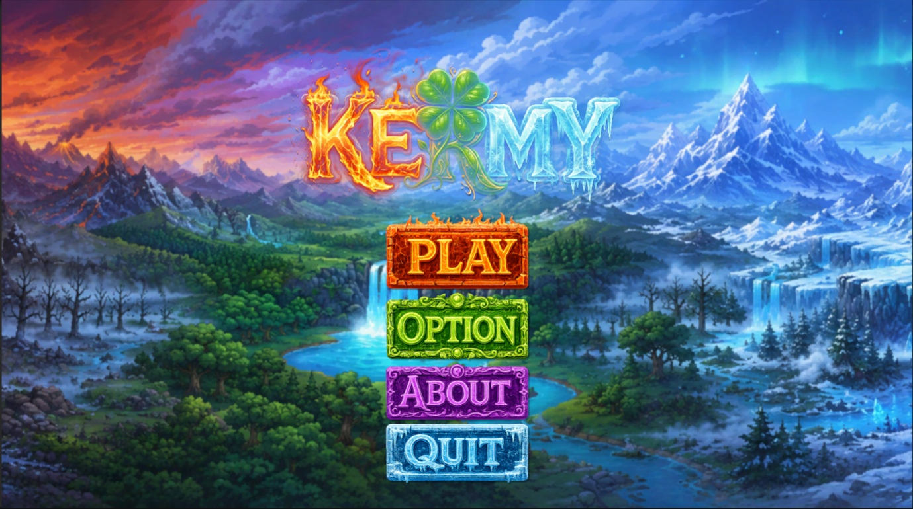
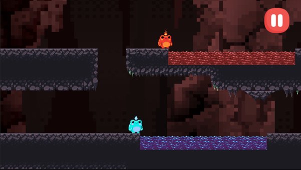
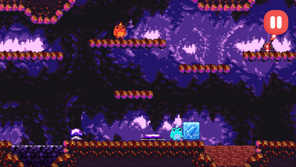
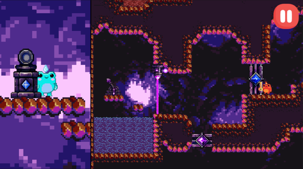
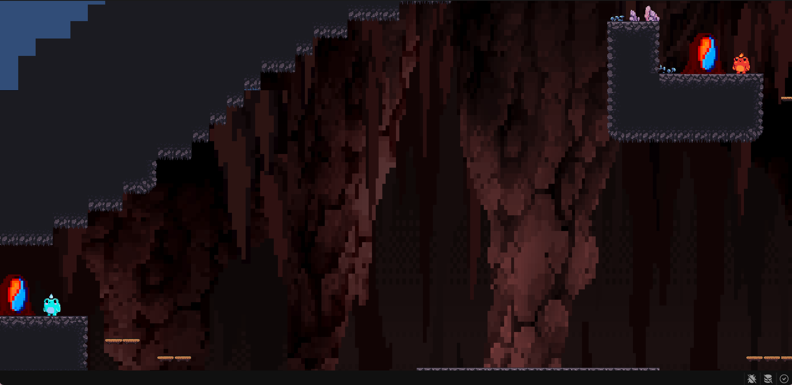
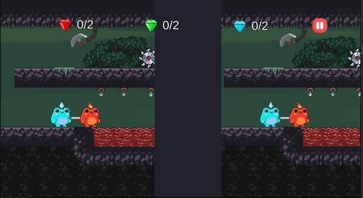
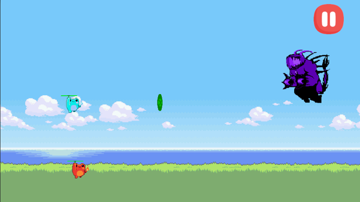
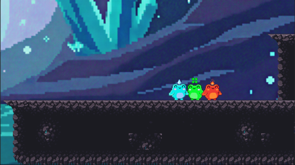

# Kermy

> Game 2D Local Co-op Puzzle Platformer được phát triển bằng Unity 6.

[](https://unity.com/)
[](https://learn.microsoft.com/dotnet/csharp/)
[](https://docs.unity3d.com/Packages/com.unity.render-pipelines.universal@17.4/)
[](https://docs.unity3d.com/Packages/com.unity.inputsystem@1.19/)
[]()

Repository: [https://github.com/nguynn12/Kermy](https://github.com/nguynn12/Kermy)

---

## Giới Thiệu

**Kermy** là một game **2D Local Co-op Puzzle Platformer** dành cho hai người chơi trên cùng một thiết bị. Trò chơi xoay quanh hai chú ếch nguyên tố **Ignus** (Lửa) và **Aqua** (Nước) trong hành trình giải cứu người bạn **Kermy** khỏi thế lực quái vật bóng đêm.

Dự án được phát triển trong khuôn khổ môn học **Phát triển ứng dụng Game / Lập trình Game**, lớp **CTK47-PM**, Khoa Công nghệ Thông tin, Trường Đại học Đà Lạt.

Game lấy cảm hứng từ các trò chơi đề cao tính phối hợp như **Fireboy and Watergirl** và **Pico Park**. Người chơi cần phối hợp liên tục để vượt địa hình, giải câu đố môi trường, né bẫy, chiến đấu với quái vật và hoàn thành từng màn chơi.

---

## Mục Tiêu Dự Án

- Xây dựng một prototype game 2D co-op ổn định, có thể chơi hai người trên cùng bàn phím.
- Thiết kế các màn chơi có độ khó tăng dần, kết hợp platforming, giải đố, cạm bẫy và chiến đấu.
- Tích hợp các cơ chế đặc trưng như dây thừng liên kết, nguyên tố, teleport, checkpoint, split-camera và trụ camera bất đối xứng.
- Vận dụng kiến thức C#, lập trình hướng đối tượng, Rigidbody2D, Collider2D, Tilemap, UI, Animation và quản lý source code bằng Git/GitHub.

---

## Screen Shot

Đặt ảnh vào thư mục `Docs/Screenshots/` và thay đúng tên file trong bảng dưới đây.

|  |  |
| --- | --- |
| **Hình 1: Main Menu**<br><br> | **Hình 2: Gameplay Level 01**<br><br> |
| **Hình 3: Puzzle Co-op**<br><br> | **Hình 4: Split Camera**<br><br> |
| **Hình 5: Teleport Portal**<br><br> | **Hình 6: Trap And Hazard**<br><br> |
| **Hình 7: Boss Battle**<br><br> | **Hình 8: Ending Scene**<br><br> |

---

## Tính Năng Chính

### Gameplay Cốt Lõi

- **Local co-op hai người chơi**: Ignus và Aqua có bộ điều khiển riêng.
- **Di chuyển platformer**: chạy, nhảy, leo thang, đứng trên moving platform và phối hợp vượt địa hình.
- **Dây thừng liên kết**: hai nhân vật bị ràng buộc khoảng cách, tạo yếu tố phối hợp khi di chuyển.
- **Hệ nguyên tố**: Ignus đại diện cho Lửa, Aqua đại diện cho Nước; một số vật thể và môi trường phản ứng theo nguyên tố.
- **Thu thập vật phẩm**: gem, key, portal và exit door.
- **Checkpoint và hồi sinh**: nhân vật quay lại checkpoint gần nhất sau khi chạm bẫy hoặc vùng nguy hiểm.

### Cơ Chế Giải Đố Và Môi Trường

- Pressure plate, linked door, lever, laser và cửa khóa.
- Pushable box, magma block, ice block, obsidian block và tương tác với tile hazard.
- Teleport portal giữa các khu vực.
- Day/night lever và vùng ánh sáng giới hạn tầm nhìn.
- Camera split-screen và trụ camera bất đối xứng để tăng sự phối hợp giữa hai người chơi.

### Chiến Đấu Và Level 05

- Hệ thống bắn đạn nguyên tố.
- Enemy wave với dơi tấn công ngẫu nhiên.
- Mini boss rồng Lửa và rồng Nước.
- Final boss nhiều giai đoạn, có laser, ultimate attack và health bar.
- Shield pickup và victory flow sau khi đánh bại boss.
- Ending scene giải cứu Kermy.

### UI / UX

- Main Menu.
- Pause Menu, restart màn, quay về menu chính.
- Keybinding UI.
- Victory screen và hiển thị kết quả thu thập.
- Âm thanh nền và hiệu ứng âm thanh cho gameplay.

---

## Công Nghệ Sử Dụng

| Công nghệ / Công cụ | Phiên bản | Vai trò |
| --- | --- | --- |
| Unity Engine | 6000.4.1f1 | Game engine chính |
| C# | Unity .NET / C# | Xây dựng logic gameplay |
| Universal Render Pipeline | 17.4.0 | Render pipeline 2D |
| Unity Input System | 1.19.0 | Điều khiển và keybinding |
| 2D Animation | 14.0.3 | Animation nhân vật và object |
| 2D Tilemap Extras | 7.0.1 | Tilemap và level building |
| Rigidbody2D / Collider2D | Built-in | Vật lý 2D và va chạm |
| Particle System | Built-in | Hiệu ứng môi trường và gameplay |
| TextMesh Pro / UGUI | Built-in | Giao diện người dùng |
| Visual Studio Code | 1.121 | Soạn thảo mã nguồn |
| Git | 2.54.0 | Quản lý phiên bản |
| GitHub | Web platform | Lưu trữ và phối hợp source code |
| Krita | 5.3.1 | Thiết kế/chỉnh sửa hình ảnh |
| Piskel | 0.14.0 | Vẽ và chỉnh sửa pixel art |

---

## Hướng Dẫn Cài Đặt

### Yêu Cầu

- Unity Hub.
- Unity Editor **6000.4.1f1**.
- Git.
- Windows 10/11 hoặc hệ điều hành có hỗ trợ Unity 6.
- Kết nối internet trong lần mở đầu tiên để Unity Package Manager tải dependency nếu cần.

### Clone Project

```bash
git clone https://github.com/nguynn12/Kermy.git
cd Kermy
```

### Mở Bằng Unity Hub

1. Mở Unity Hub.
2. Chọn **Add project**.
3. Chọn thư mục `Kermy`.
4. Mở bằng Unity **6000.4.1f1**.
5. Chờ Unity import toàn bộ assets.

### Chạy Trong Unity Editor

1. Mở scene `Assets/_Scenes/MainMenu.unity`.
2. Nhấn **Play**.
3. Chọn bắt đầu game từ menu chính.

### Build Game

Các scene đã được cấu hình trong Build Settings:

1. `Assets/_Scenes/MainMenu.unity`
2. `Assets/_Scenes/Level01.unity`
3. `Assets/_Scenes/Level02.unity`
4. `Assets/_Scenes/Level03.unity`
5. `Assets/_Scenes/Level04.unity`
6. `Assets/_Scenes/Level05.unity`
7. `Assets/_Scenes/ENDING.unity`

Để build:

1. Vào **File -> Build Profiles** hoặc **File -> Build Settings**.
2. Chọn platform mong muốn.
3. Kiểm tra danh sách scene ở trên.
4. Nhấn **Build**.

---

## Cách Chơi

| Người chơi | Di chuyển | Nhảy / leo lên | Tương tác / bắn |
| --- | --- | --- | --- |
| Player 1 - Ignus | `A` `D` / `W` `S` | `W` | `Q` |
| Player 2 - Aqua | Phím mũi tên | `Up Arrow` | `Space` |

Phím chung:

- `Esc`: mở hoặc đóng Pause Menu.
- Trong Level 05, phím di chuyển được dùng để bay; phím tương tác được dùng để bắn.
- Keybinding có thể được thay đổi trong giao diện cấu hình phím nếu scene/menu bật hệ thống này.

---

## Cấu Trúc Thư Mục

```text
Kermy/
├── Assets/
│   ├── _Scenes/              # MainMenu, Level01-Level05, ENDING
│   ├── _Archive/             # Scene backup
│   ├── Art/                  # Visual assets, sprites, animations, controllers
│   ├── Audio/                # BGM và SFX
│   ├── Material/             # Material và Physics Material 2D
│   ├── Prefabs/              # Prefab gameplay, trap, player, UI, Level05
│   ├── Resources/            # Input actions load runtime
│   ├── Script/               # 88 script C#
│   ├── TextMesh Pro/         # Tài nguyên TextMesh Pro
│   └── Tile/                 # Tilemap, tile palette và tile assets
├── Packages/                 # Unity Package Manager manifest
├── ProjectSettings/          # Cấu hình Unity project
└── README.md
```

### Nhóm Script Chính

- `Audio`: quản lý nhạc nền, hiệu ứng âm thanh và audio trigger.
- `Camera`: camera follow, split-screen, camera station và camera bất đối xứng.
- `Checkpoint`: checkpoint và respawn.
- `Elements`: định nghĩa hệ nguyên tố.
- `Hazards` và `Trap`: bẫy, laser, vùng nguy hiểm và xử lý sát thương.
- `Key and gem`: gem, key, inventory và exit portal.
- `Level`: quản lý màn chơi, cửa thoát và chuyển scene.
- `Level05`: enemy, bullet, boss, shield và gameplay bay bắn.
- `Mechanics`: ladder, pressure plate, lever, moving platform, falling platform, box, bounce pad, teleport.
- `Menu` và `UI`: main menu, pause menu, keybinding UI, victory screen.
- `Player`: movement, input handler, rope, particle và hỗ trợ co-op.
- `Systems`: day/night transformer và background scaler.

---

## Kết Quả Đạt Được

- Hoàn thành hệ thống di chuyển hai nhân vật bằng Rigidbody2D.
- Hoàn thành cơ chế local co-op, split-camera và camera hỗ trợ.
- Hoàn thành hệ thống bắn đạn nguyên tố, enemy wave, mini boss và final boss.
- Hoàn thành các cơ chế trap, hazard, checkpoint, teleport, lever, pressure plate và linked door.
- Hoàn thành menu, pause menu, UI cơ bản và hệ thống âm thanh.
- Quản lý source code bằng GitHub trong quá trình làm việc nhóm.

---

## Hạn Chế Hiện Tại

- Chưa hỗ trợ online multiplayer.
- Chưa có hệ thống save/load tiến trình dài hạn.
- AI quái vật mới ở mức cơ bản, chưa có pathfinding nâng cao.
- Số lượng màn chơi và cơ chế giải đố còn giới hạn trong phạm vi đồ án.
- Hiệu ứng hình ảnh và animation vẫn có thể tiếp tục được cải thiện.
- Cân bằng độ khó gameplay cần thêm thời gian kiểm thử.

---

## Hướng Phát Triển

- Bổ sung chế độ online hoặc LAN co-op bằng Unity Netcode/Mirror.
- Mở rộng thêm màn chơi, loại bẫy, enemy và puzzle mới.
- Cải thiện AI bằng pathfinding như A*.
- Thêm save/load bằng PlayerPrefs hoặc JSON.
- Nâng cấp animation, particle, ánh sáng và hiệu ứng chiến đấu.
- Đóng gói bản WebGL hoặc phát hành thử nghiệm trên itch.io.

---

## Thành Viên Nhóm

| STT | Họ tên | Vai trò |
| --- | --- | --- |
| 1 | Tạ Nhật Nguyên | Leader, Developer |
| 2 | Võ Hùng Mạnh | Developer |
| 3 | Trần Ngọc Bảo Phước | Developer |
| 4 | Nguyễn Nhất Minh | Developer |
| 5 | Nguyễn Khiêm Thuận | Developer |

---

## Thông Tin Đồ Án

- Trường: **Trường Đại học Đà Lạt**
- Khoa: **Công nghệ Thông tin**
- Lớp: **CTK47-PM**
- Môn học: **Phát triển ứng dụng Game / Lập trình Game**
- Đề tài: **Xây dựng game 2D Co-op Platformer - Kermy**
- Giảng viên hướng dẫn: **KS. Nguyễn Trọng Hiếu**
- Thời gian: **Tháng 5 năm 2026**

---

## Tài Liệu Tham Khảo

- [Unity Documentation](https://docs.unity3d.com/Manual/index.html)
- [Unity Scripting API](https://docs.unity3d.com/ScriptReference/)
- [Microsoft C# Documentation](https://learn.microsoft.com/dotnet/csharp/)
- [GitHub Docs](https://docs.github.com/)
- [Unity Input System](https://docs.unity3d.com/Packages/com.unity.inputsystem@1.19/)
- [Universal Render Pipeline](https://docs.unity3d.com/Packages/com.unity.render-pipelines.universal@17.4/)
- [Game Programming Patterns](https://gameprogrammingpatterns.com/)
- [Cavern Set by Draconimous](https://draconimous.itch.io/cavern-set)
- [Free Swamp 2D Tileset Pixel Art by Free Game Assets](https://free-game-assets.itch.io/free-swamp-2d-tileset-pixel-art)
- [Super Pixel Cave Tileset by unTied Games](https://untiedgames.itch.io/super-pixel-cave-tileset)

---

## License

Dự án được phát triển phục vụ mục đích học tập trong khuôn khổ đồ án môn học. Mã nguồn và nội dung trong repository được sử dụng cho mục đích học tập, báo cáo và trình bày sản phẩm. Các tài nguyên bên thứ ba, nếu có, tuân theo giấy phép của tác giả hoặc nhà phát hành tương ứng.

---

<div align="center">

**Kermy**

_Unity 6000.4.1f1 · 2D Local Co-op Puzzle Platformer_

Trường Đại học Đà Lạt · Khoa Công nghệ Thông tin · CTK47-PM · 05/2026

GVHD: **KS. Nguyễn Trọng Hiếu**

</div>
